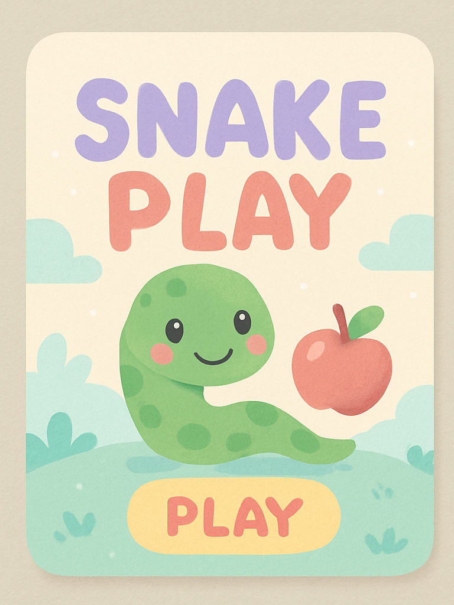
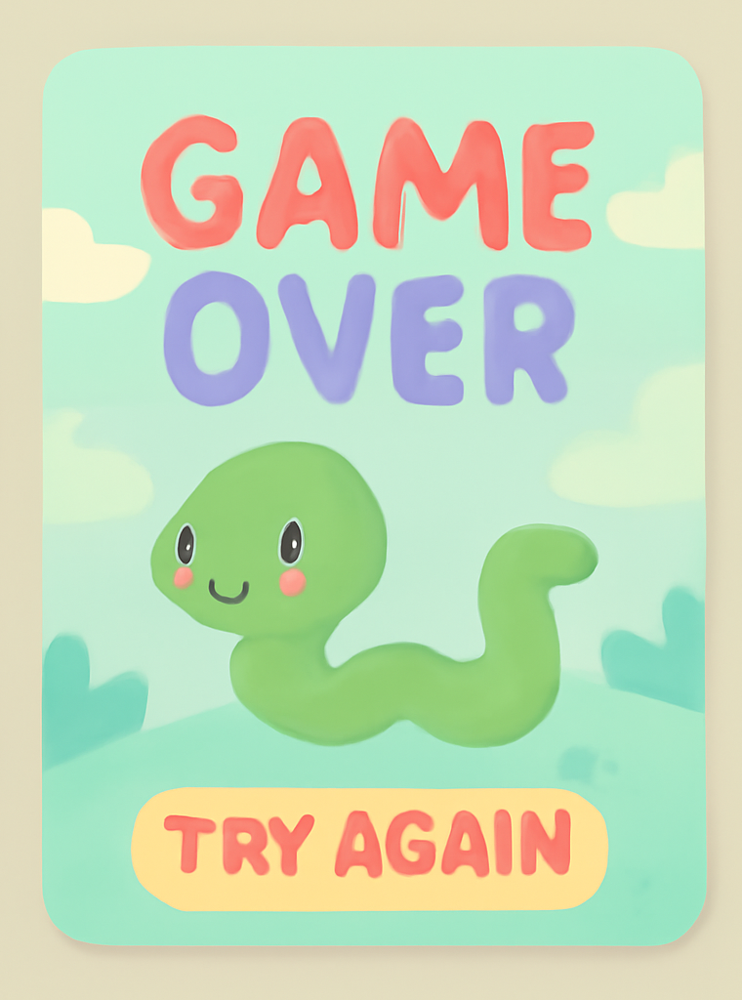

# 🐍 Snake Game

Welcome to the **Smiling Snake Game** – a fun, light-hearted twist on the classic Snake, designed especially for kids!

<div align="center">

</div>

## ✨ Features

- 🐍 **Smiling snake** that grows as you score
- 🎨 **Game UI made for kids** — soft visuals and readable text
- 🏁 **Score displayed** on a custom **Game Over** screen
- 🔊 **Playful sound effects** and **smooth gameplay**
- 🎮 **Easy controls** with arrow keys or WASD
- ⭐ **Level progression** with increasing difficulty

<div align="center">

</div>

## 🎮 How to Play

1. **Run the game**: Execute the `snake_game.py` file
2. **Control your snake** using arrow keys or WASD:
   - ⬆️ **Up Arrow** or **W**
   - ⬇️ **Down Arrow** or **S**
   - ⬅️ **Left Arrow** or **A**
   - ➡️ **Right Arrow** or **D**
3. **Eat the food** 🍎 to grow your snake and increase your score
4. **Avoid collisions** with yourself or the walls
5. **Level up!** Every 3 points increases your level and speed
6. **Enjoy** the cute visuals and have fun!

> **Important:** Make sure the image files (`snake_play.png`, `game_last.png`, etc.) are in the same folder as the `.py` file.

## 🛠️ Requirements

- Python 3.x
- Pygame library (`pip install pygame`)

## 🚀 Quick Start

```bash
# Clone or download the repository
# Navigate to the game folder
# Install pygame if you haven't already
pip install pygame

# Run the game
python snake_game.py
```

---

## 🤝 Contributing

This is a **beginner-friendly** project!
Feel free to **open issues** or **submit PRs** to improve the game or design.

**Ideas for contributions:**
- Add more sound effects
- Create new themes or color schemes
- Implement high score saving
- Add power-ups or special food items

---

## 🧒 Made for Kids, by a Kid at Heart

This game was created with **love**, a **feeling of NOSTALGIA**, and a **passion for fun**.
Perfect for those learning Python or looking to bring a smile to young players' faces.

---

## 📬 Contact

For questions, suggestions, or just to say hi:

- [Jahnavi Israni – LinkedIn](https://www.linkedin.com/in/jahnaviisrani/)
- [Email: jahnaviisrani12@gmail.com](mailto:jahnaviisrani12@gmail.com)

---

## ⭐ Don't forget to star this repo if you like it!

---

**Happy coding!** 😊🐍✨